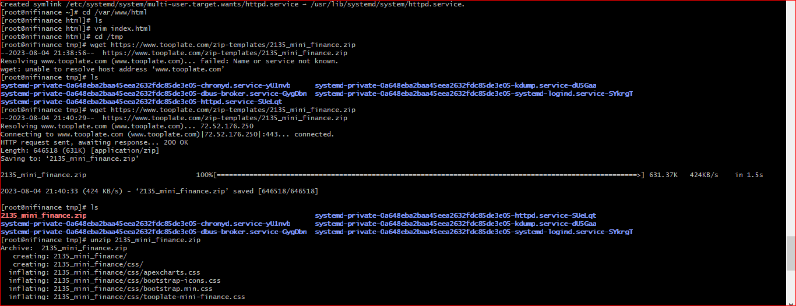

search for centos9 on vagrantcloud.com 

select the required vm image and copy the name of the vm

spin up the vm in your vm folder `vagrant init "name_of_vm"`

open the vagrantfile and open the following configurations;
- private ip (change the ip to a unique one)
- public ip
- Ram &
- End 

save and close vagrantfile

start the vm `vagrant up`

login to vm `vagrant ssh`

swicth to root user `sudo -i`

open /etc/hostname file `vi /etc/hostname`

edit the file by typing your desired hostname

save and close file

run `hostname 'the_name_you_used'`

logout and logim to vm again for hostname to take effect

enter root user again

download the following;

- unzip, zip, vim, wget, httpd(apache2 in ubuntu) `yum install wget httpd vim zip unzip -y`

start and enable httpd `systemctl start httpd` `systemctl enable httpd` 

check httpd status `systemctl status httpd`

check the ip address `ip addr show`. Copy and paste ina browser and see httpd start page

follow the documentation on the start page to finish;
- create and open a file vim /var/www/html/index.html

go to tooplate.com on a browser and search for a website template 

select desired template and click f12 on your keybord to show the abosolute link of the template under network

click download and copy the .zip absolute link

download the the template on your vm `wget 'link_of_template'`

enter /tmp directory and unzip the template `unzip 'zipped_template_filename'` 

copy all the unzipped files into the var/www/html directory `cp -r * /var/www/html`

restart httpd `systemctl restart httpd`

check firewalld status and and disable if its active `systemctl status firewalld` `systemctl stop firewalld` `systemctl disable firewalcopy and paste ip address again in browser

The output of the browser is the website

