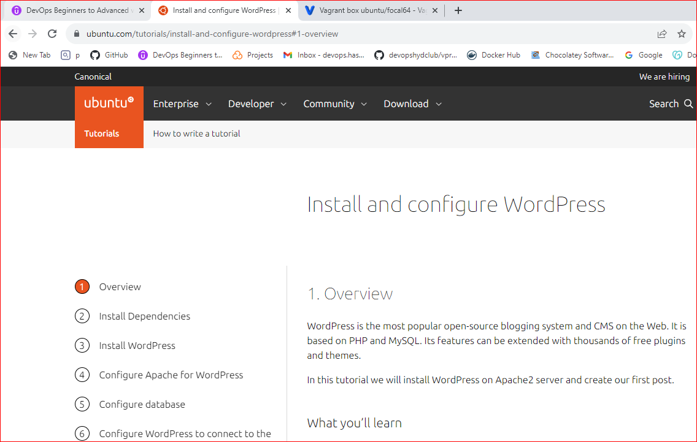

## INSTALLING AND SETTING UP WORDPRESS ON UBUNTU

search 'ubuntu 20' vm from vagrntcloud and select 'ubuntu focal' 

spin up the vm in your vm folder 

edit the vagrantfile as done in manual website setup
open the vagrantfile and open the following configurations;
- private ip (change the ip to a unique one)
- public ip
- Ram &
- End

start the vm `vagrant up`

login to the vm `vagrant ssh`

switch to root user and change hostname as done in manual website setup

search for 'installing wordpress on ubuntu' in your browser under the ubuntu website 

follow the documentation and make sure you run the codes one after the order till the end

set up mysql from the documentation 

find the IP of the vm `ip addr show`

search the IP on your browser to access wordpress on your browser 

set up and login to your wordpress site 

