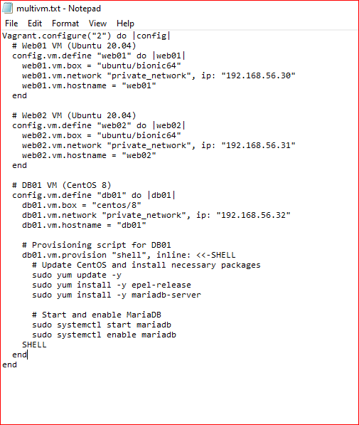
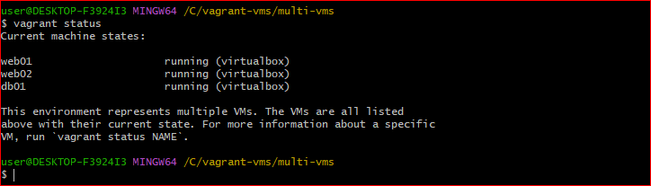
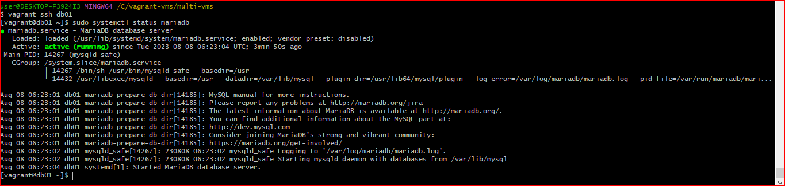

# SETTING UP MULTIPLE VMs AUTOMATICALLY USING VAGRANTFILE

- open a Vagrantfile

- edit the vagrant file to spin up all the VMs you want with the specifications you want. 

- in the project folder, spin up the VMs `vagrant up`

- check if the VMs are running `vagrant status` 

- login into the VM you want to with the specified name `vagrant ssh 'vm-name'`

- check the status of one the systems you installed "mariadb" `systemctl status mariadb` 
