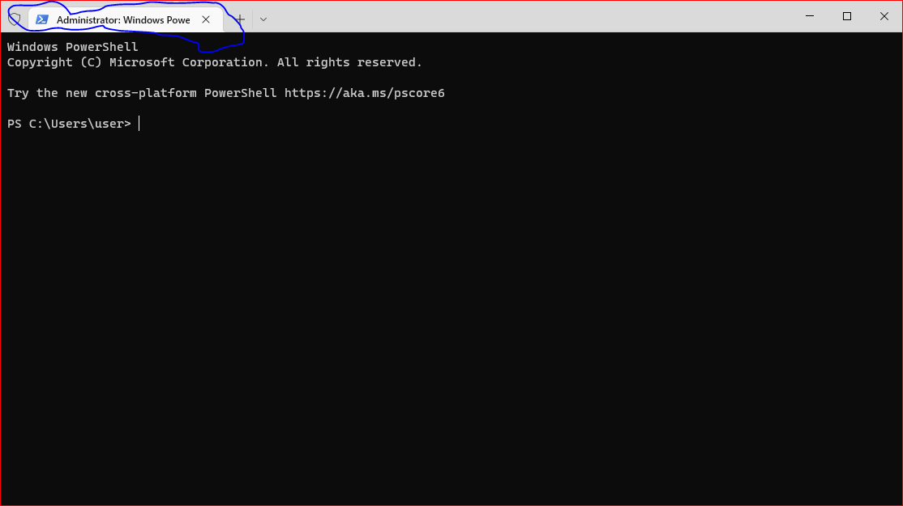
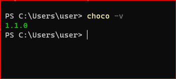
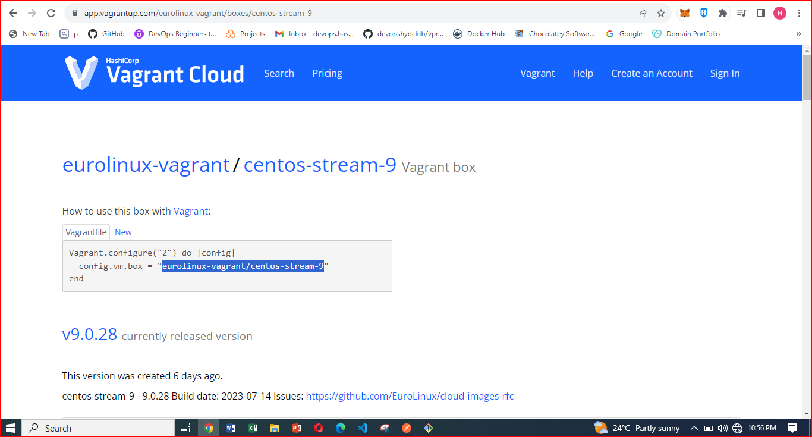
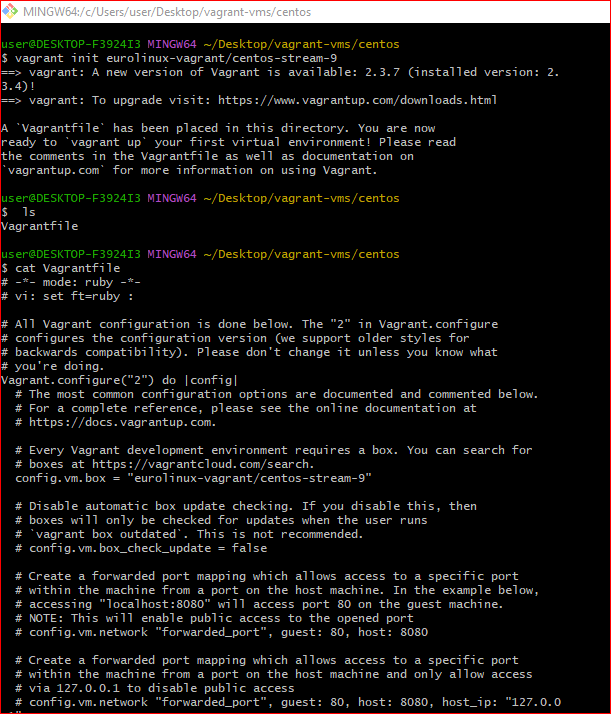
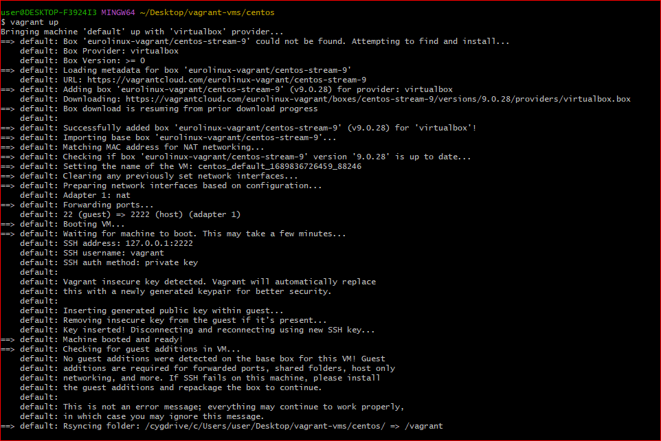
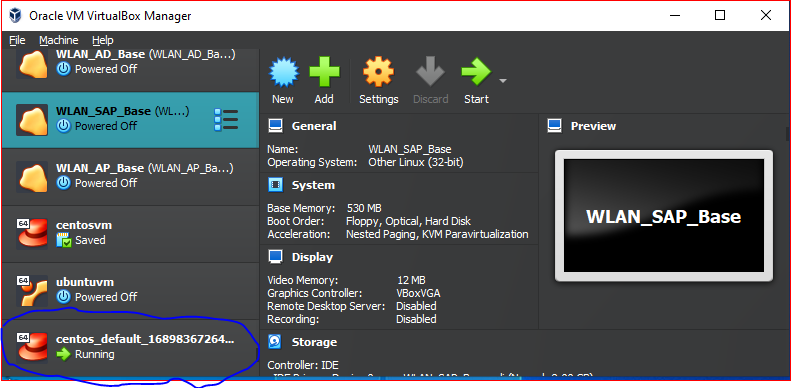
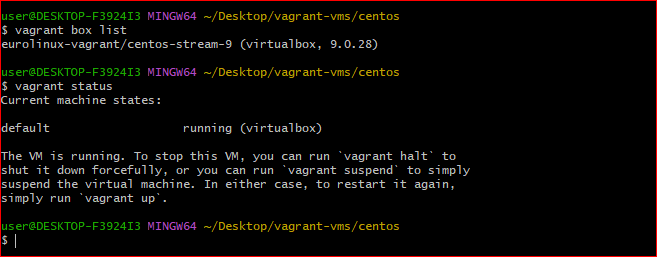
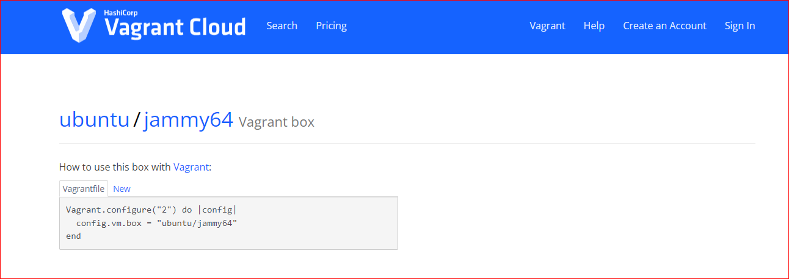
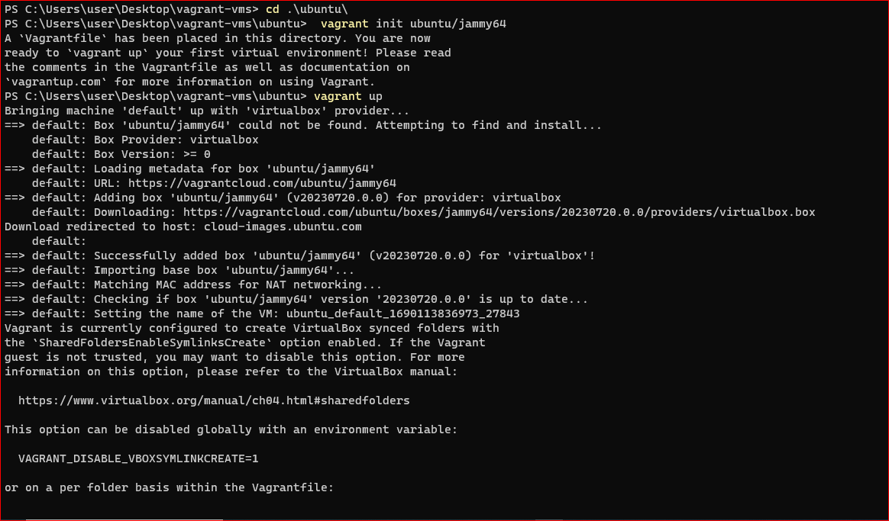

# Using vagrant to automate virtual machines
## Prerequisites 

-Open your browser and search for `install chocolatey for windows/MacOS` depending on your system

 Open powershell as administrator 

-Follow the steps to install chocolatey using powershell

-Run `choco -v` on powershell to see the chocolate version and confirm installation 
-Install Oracle VM VirtualBox

-Search vagrant cloud on your browser

-Search centos 9 on vagrant cloud. 

-Copy the command to install the required centos 9 image.

-Create a vagrant-vm folder in your preferred location

-Inside the vagrant-vm folder, create a folder with the name of the OS you want to install. In our case, (centos 9).

-`cd` inside the folder of the OS, type `vagrant init` followed by pasting the command you copied from vagrant cloud.

-`ls` to see the Vagrantfile and also confirm successful installation 

-`vagrant up` to start the VM 

-Go to Oracle VM virtualBox to confirm the if the VM is up 

-`vagrant status` to see status of VM on command prompt 

`ssh vagrant` to ssh into the centos 9 VM

`exit` to leave VM

-`vagrant halt` to stop VM

- Repeat same steps for ubuntu using the name "ubuntu jammy"

