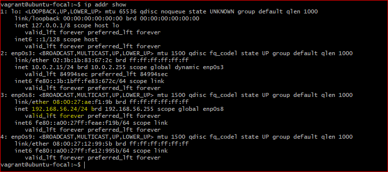

# SET UP A WORDPRESS SITE AUTOMATICALLY
- In the folder, initialize vagrant with the name of the VM `vagrant init`

- open the Vagrantfile and edit the file as done in previous projects.

- edit the provisioning section of the vagrantfile while following the ubuntu wordpress documentation. 

- start the VM `vagrant up`

- login to the VM `vagrant ssh` 

- find the ip address `ip addr show` 

- copy the ip address and search in a browser. 

